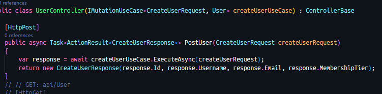

# Got Id=0 when query entity

## ❗Important rule (this is the core lesson)

Never construct response DTOs that depend on DB-generated values before SaveChanges()
this applies to:

- IDs
- timestamps
- computed columns
- triggers
- version columns

Below Image causing returned user.Id = 0 as havent done commit async for transaction

### Solution

With API That need to returned the above information (DB-generated), please:

- always use raw entity (get from DB) to pass repo -> service -> use-case
- DTO mapping only happen in controller

### one-sentence takeaway (memorize this)

Mutations return entities; controllers return DTOs.

